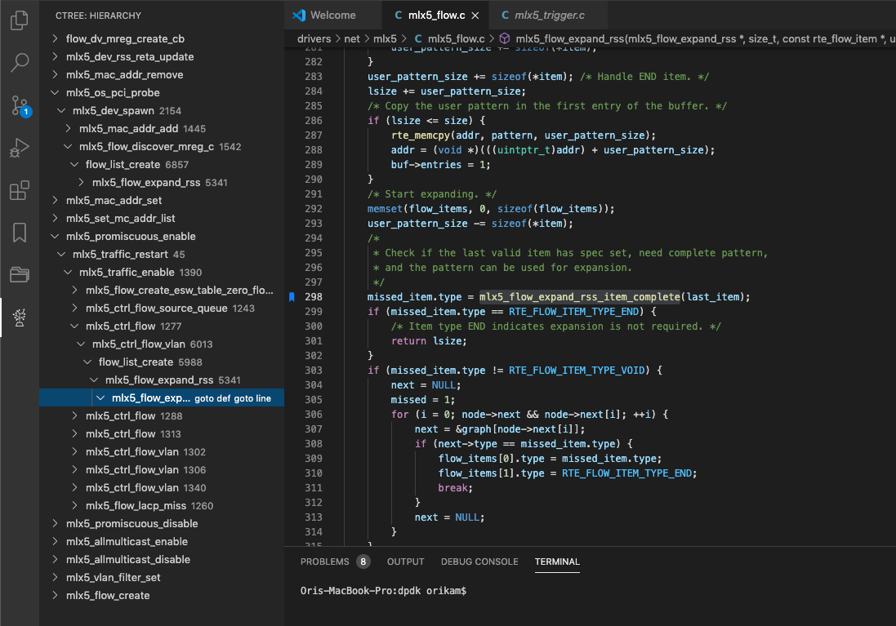

# VSCode - CTree README

This extension creates C call graph (call hierarchy), using the cscope utility.

## Features

The main feature is creating a call hierarchy graph, for C code.

> Tip: After creating the call hierarchy, it is possible to jump to any function definition or usage.

## Requirements

This extension uses the cscope utility.

### Install on Linux

sudo apt install cscope

### Install on Mac

brew install cscope

## Known Issues

No known issues.

## Release Notes

### 1.0.0

Initial release.

-----------------------------------------------------------------------------------------------------------

## Working with CTree

* Build the cscope database using the build command. The build command can be accessed using the command palette (`ctree build`), or from the editor context (`mouse right click + ctree + build`).
* Open the call hierarchy by standing on a function, and issue the show command (from the command palette or from the editor context).
* While overring over CTree entry clicking goto ref will open the editor on the calling line. While clicking got def will open the editor on the definition of the function.

**Enjoy!**
